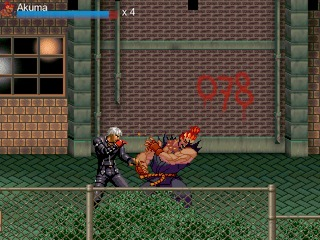

# About
!!! example "Paintown is a free and open source 2D Fighting Game"
    { align=left }
    <iframe width="309" height="255" src="https://www.youtube.com/embed/Imk8dR7Gsek" title="Paintown 3.3 Release Candidate" frameborder="0" allow="accelerometer; autoplay; clipboard-write; encrypted-media; gyroscope; picture-in-picture; web-share" allowfullscreen></iframe>

## Why Paintown?
If you are looking for a side-scrolling, action packed game like you used to play or if you are looking for an extensible engine to write your own game, look no further. Paintown supports user created content through a mod system and user defined functionality through scripting.

Paintown also supports an implementation of M.U.G.E.N. Our goal is to be 100% compatible with M.U.G.E.N 2002.04.14 beta as well as supporting any new updates in the 1.0 version.

Paintown is completely open-source and we would love any contributions in the form of code, art, or donations. Give Paintown a try!

## Features

* BSD License
* Low CPU and GPU requirements
* Network play
* Dynamic lighting
* Joystick support
* mod/s3m/xm/it/mp3/ogg music modules
* Scripting with python
* M.U.G.E.N engine
* Ports to many systems