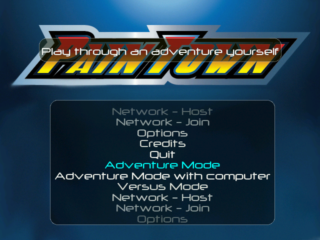
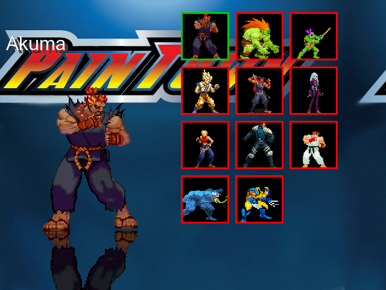
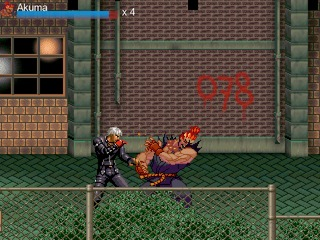

# Media
Screenshots and Videos

## Screenshots
{ align=left: style="width: 380px" }
{ align=left: style="width: 380px"  }
{: style="width: 380px" }

## Videos
??? quote "3.3.1 tech demo"
    <iframe width="504" height="284" src="https://www.youtube.com/embed/Imk8dR7Gsek" title="Paintown 3.3 Release Candidate" frameborder="0" allow="accelerometer; autoplay; clipboard-write; encrypted-media; gyroscope; picture-in-picture; web-share" allowfullscreen></iframe>
??? quote "Running on the PSP"
    <iframe width="504" height="284" src="https://www.youtube.com/embed/ysBRtz3wC1Y" title="Paintown port to PSP" frameborder="0" allow="accelerometer; autoplay; clipboard-write; encrypted-media; gyroscope; picture-in-picture; web-share" allowfullscreen></iframe>
??? quote "Running on Dingux"
    <iframe width="504" height="284" src="https://www.youtube.com/embed/7wTpiVu8taA" title="Paintown Running on Dingux - Adventure Mode" frameborder="0" allow="accelerometer; autoplay; clipboard-write; encrypted-media; gyroscope; picture-in-picture; web-share" allowfullscreen></iframe>
??? quote "Running on the Wii"
    <iframe width="504" height="284" src="https://www.youtube.com/embed/GS49ecqpUtk" title="Paintown port to wii" frameborder="0" allow="accelerometer; autoplay; clipboard-write; encrypted-media; gyroscope; picture-in-picture; web-share" allowfullscreen></iframe>